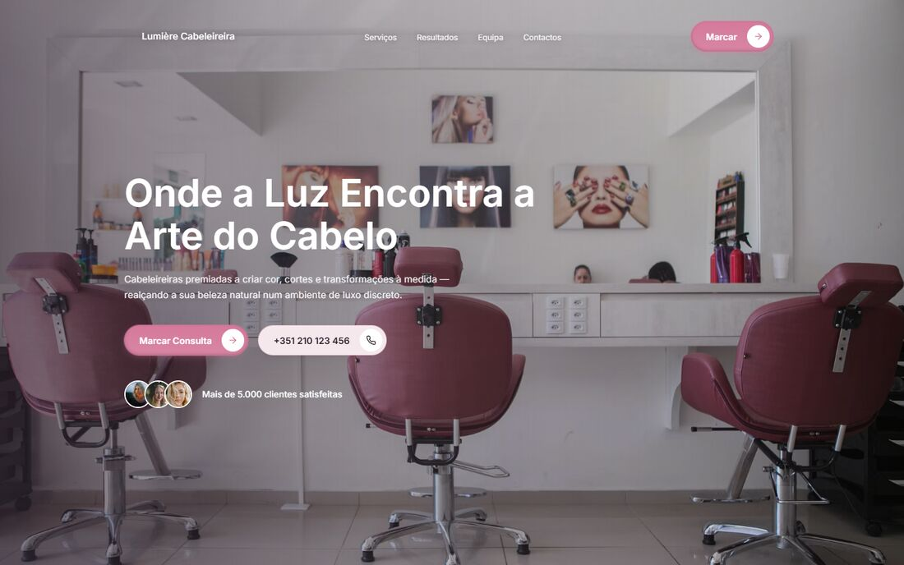
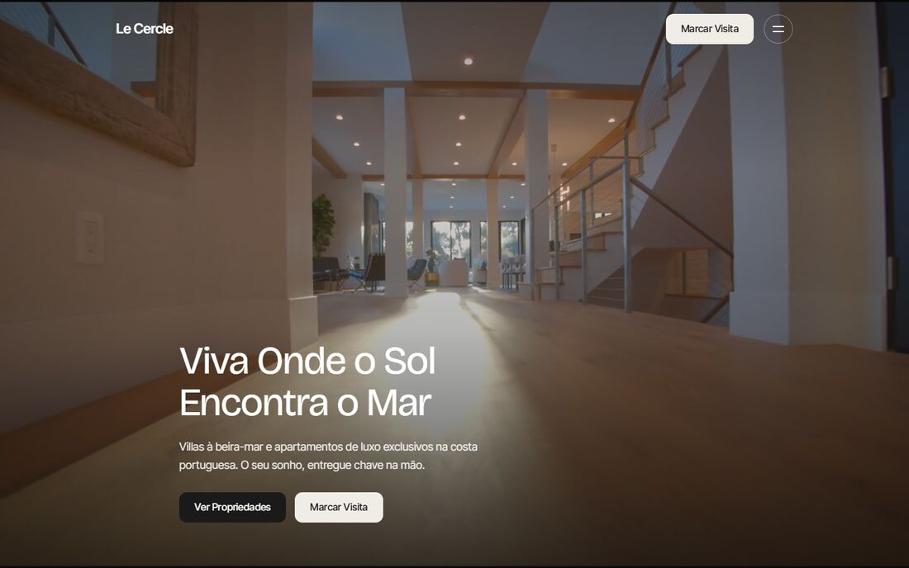
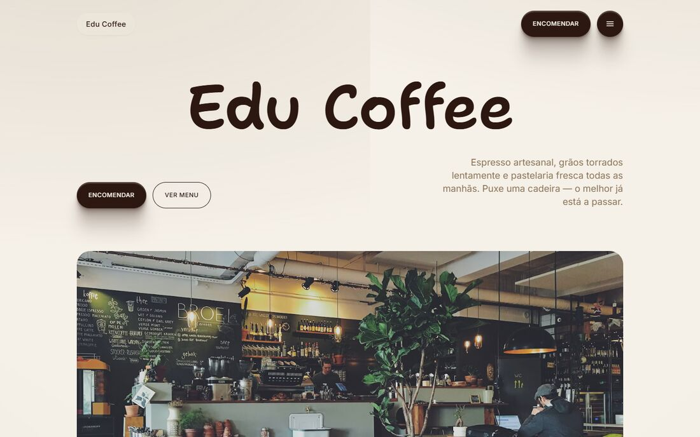
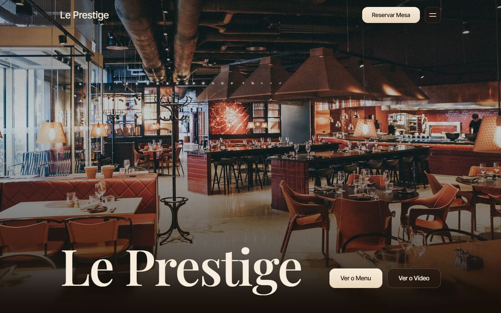
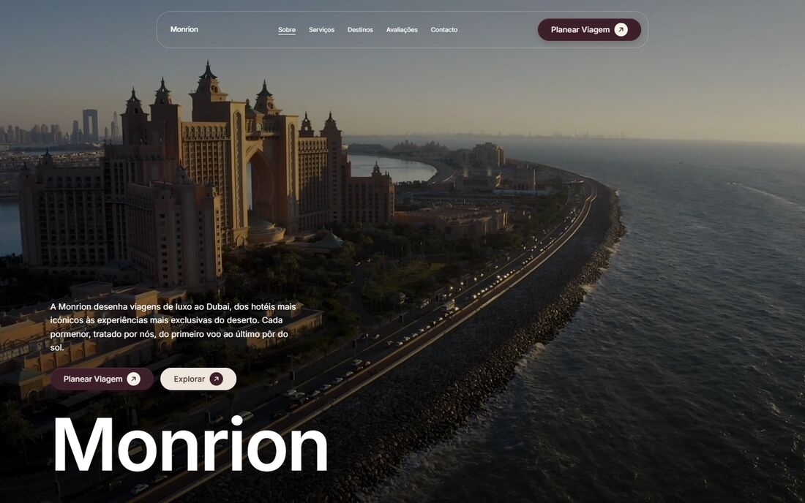

# Front-end demo sites (menu-projetos)

[](https://github.com/EduardoRochaFernandes/menu-projetos/actions/workflows/pages.yml)
[](LICENSE)

A landing page plus five self-contained website concepts (hair salon, real estate, coffee shop, restaurant, travel agency),
built as a front-end portfolio: layout, typography, scroll-driven video, hover interactions and responsive design.

## Live demo (one click)

**https://eduardorochafernandes.github.io/menu-projetos/**

> **Language note:** the demo sites are written in **Portuguese (pt-PT) on purpose**. They were designed as mock-ups for the Portuguese
> market. Everything else in this repository (documentation, code comments, CI) is in English.
> All brands, addresses, phone numbers, e-mails and customer claims inside the demos are fictional placeholders.

## The demos

| Demo | Concept | Tech | Preview |
|---|---|---|---|
| [`lumiere/`](https://eduardorochafernandes.github.io/menu-projetos/lumiere/) | Luxury hair salon: services, results, team, contact | Next.js static export (React) |  |
| [`le-cercle/`](https://eduardorochafernandes.github.io/menu-projetos/le-cercle/) | Luxury real estate: scroll-scrubbed video hero, villa cards that play a video on hover, glass-style contact form | Vanilla HTML / CSS / JS |  |
| [`joes-coffee/`](https://eduardorochafernandes.github.io/menu-projetos/joes-coffee/) | Coffee shop ("Edu Coffee"): filterable menu, events, locations | Vanilla HTML / CSS / JS |  |
| [`aurion/`](https://eduardorochafernandes.github.io/menu-projetos/aurion/) | Fine-dining restaurant ("Le Prestige"): dark editorial look, menu, experiences, reservations | Vanilla HTML / CSS / JS |  |
| [`monrion-travel/`](https://eduardorochafernandes.github.io/menu-projetos/monrion-travel/) | Luxury travel agency for Dubai trips | Next.js static export (React) |  |

Screenshots are real captures (headless Edge via Playwright, 1440x900) of the pages as deployed.

## Run it locally

Requires Node.js 18 or newer, no dependencies:

```bash
git clone https://github.com/EduardoRochaFernandes/menu-projetos.git
cd menu-projetos
node server.js          # http://127.0.0.1:5182  (or: node server.js 5190)
```

`server.js` is a tiny static server with HTTP Range support. Range support matters: without it browsers cannot seek in the
Le Cercle hero video and the scroll scrubbing breaks (this is why `python -m http.server` is not enough).

## How the deployment works

GitHub Pages is deployed by a GitHub Actions workflow ([`.github/workflows/pages.yml`](.github/workflows/pages.yml)) using `actions/deploy-pages`:

1. `scripts/build-pages.mjs` copies the sites into `_site/`. The two Next.js exports were built with absolute asset paths
   (`/lumiere/_next/...`), which would 404 under the `/menu-projetos/` sub-path, so the copy is rewritten to
   `/menu-projetos/lumiere/_next/...`. The source folders are not modified, so `node server.js` keeps working at the domain root.
2. `scripts/check-links.mjs` fails the build if any local `src`/`href`/`poster`/CSS `url()` points to a missing file.
3. The artifact is deployed, then a smoke-test job requests every demo URL on the live site and expects HTTP 200.

A second workflow ([`quality.yml`](.github/workflows/quality.yml)) runs HTML validation and Lighthouse. It is advisory and never blocks.

## Project structure

```
.
├── index.html            # English landing page (the hub)
├── aurion/               # restaurant demo (HTML/CSS/JS)
├── joes-coffee/          # coffee shop demo (HTML/CSS/JS)
├── le-cercle/            # real-estate demo (HTML/CSS/JS + assets/ videos and photos)
├── lumiere/              # hair salon demo (Next.js static export, build output only)
├── monrion-travel/       # travel demo (Next.js static export, build output only)
├── docs/screenshots/     # preview images used by the landing page and this README
├── scripts/              # build-pages, check-links, screenshots, lighthouse-summary
├── server.js             # local dev server with Range support
└── .github/workflows/    # pages.yml (deploy), quality.yml (advisory checks)
```

## Status, limitations and known issues

- **Heavy videos.** About 64 MB of the repository is video in `le-cercle/assets/`: the hero is 15 MB and the six villa-card videos
  are 2 to 18 MB each. Only the hero loads on page open; card videos load lazily on the first hover. They have not been re-encoded
  yet (no `ffmpeg` was available when this repo was reviewed); re-encoding to H.264 at a higher CRF would shrink them a lot.
- **Hot-linked stock media.** `aurion/`, `joes-coffee/`, `lumiere/` and `monrion-travel/` load photos from Unsplash and some videos from Pexels at runtime.
  They were all reachable when checked, but a removed upstream image would leave a gap. Details in [CREDITS.md](CREDITS.md).
- **Next.js demos are build output.** Only the exported files are in this repo, not their source projects.
- **Provenance gaps.** The origin of `le-cercle/assets/hero-1080.mp4` and the exact Unsplash IDs of the Le Cercle photos were not recorded (see CREDITS.md).
- These are design mock-ups: there is no backend, so the contact and booking forms are not connected to anything.

## Credits and license

Code: [MIT](LICENSE). Photos, videos and fonts: third-party, see [CREDITS.md](CREDITS.md).

Author: [Eduardo Fernandes](https://github.com/EduardoRochaFernandes)
